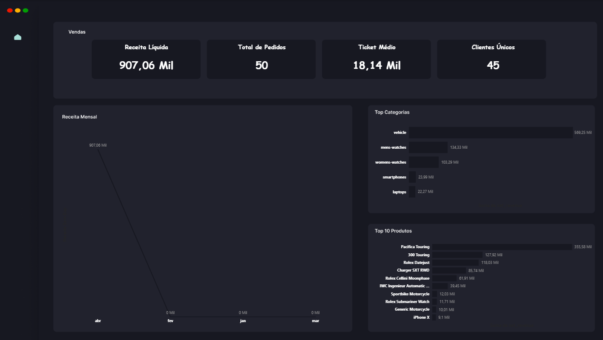

# � Sales Pipeline: Data Engineering Mastery Project

[](https://github.com/seuuser/sales-pipeline)
[](https://github.com/seuuser/sales-pipeline)
[](https://github.com/seuuser/sales-pipeline)

> Um pipeline de dados end-to-end que transforma um Data Analyst em um profissional completo, demonstrando habilidades avançadas em engenharia de dados através de um projeto portfólio impressionante.



---

## 🌟 Visão Geral

Este projeto representa a **evolução definitiva de um Data Analyst para um profissional completo de dados**. Construído com as ferramentas mais modernas do mercado, ele resolve o desafio crítico de transformar dados brutos de vendas em insights acionáveis de forma totalmente automatizada e escalável. Imagine recrutadores vendo isso no seu portfólio — eles vão ficar impressionados com a profundidade técnica e o impacto prático.

## 🎯 O Problema que Resolve

No ecossistema de dados atual, a lacuna entre análise e engenharia é cada vez mais evidente. Recrutadores não buscam mais apenas analistas que sabem Excel e Power BI — eles querem profissionais que entendam **engenharia de dados básica**: ingestão automatizada, modelagem robusta, orquestração de pipelines e qualidade garantida.

**Cenário Real:** Uma empresa de e-commerce precisa processar dados de vendas diários vindos de uma API, transformar esses dados em métricas de negócio confiáveis, e alimentar dashboards executivos sem intervenção manual. Sem um pipeline adequado, isso resulta em dados inconsistentes, atrasos e decisões baseadas em informações obsoletas.

**Minha Solução:** Um pipeline ELT completo usando arquitetura Medallion (Bronze → Silver → Gold), orquestrado por Apache Airflow, modelado com dbt e visualizado no Power BI. Tudo rodando em containers Docker para reprodutibilidade total.

## 🏗️ Arquitetura Técnica

```
🌐 API de Vendas → 🐍 Python Ingestão → 🥉 Bronze Layer (Dados Brutos)
                        ↓
                🎼 Apache Airflow DAG (@daily)
                        ↓
    🥈 Silver Layer (Limpeza & Normalização) → 🔄 dbt Models
                        ↓
    🥇 Gold Layer (Agregações & KPIs) → 📊 Power BI Dashboard
                        ↓
            🛡️ Monitoramento (Tests + Alerts)
```

**Fluxo Detalhado:**
1. **Ingestão**: Script Python consome API e armazena dados brutos no PostgreSQL
2. **Orquestração**: Airflow dispara tarefas diárias em sequência
3. **Transformação**: dbt aplica limpeza, joins e agregações
4. **Qualidade**: Testes automatizados garantem integridade
5. **Visualização**: Power BI conecta diretamente às tabelas Gold

## 🛠️ Stack Tecnológico (Ferramentas de Mercado)

| Categoria | Ferramentas | Por que Escolhi |
|-----------|-------------|-----------------|
| **🐍 Linguagem** | Python 3.9+ | Versátil para ETL e scripting |
| **🐳 Infraestrutura** | Docker + Docker Compose | Ambientes reprodutíveis e portáveis |
| **🗄️ Banco de Dados** | PostgreSQL | Robusto para dados relacionais |
| **🔄 Modelagem** | dbt (Data Build Tool) | Padrão da indústria para transformação |
| **🎼 Orquestração** | Apache Airflow | Ferramenta enterprise para workflows |
| **📊 Visualização** | Power BI + DAX | Dashboards interativos e avançados |
| **🧪 Qualidade** | dbt Tests + Schema.yml | Validações automatizadas |

**Justificativa da Stack:** Cada ferramenta foi escolhida por ser líder de mercado e demonstrar proficiência em conceitos modernos de dados.

## ✨ Funcionalidades que Impressionam Recrutadores

### 📥 **Ingestão Inteligente**
- **API Integration**: Conexão robusta com endpoints RESTful
- **Incremental Loading**: Apenas dados novos são processados
- **Error Handling**: Retry logic e logging detalhado
- **Camada Bronze**: Preserva dados originais para auditabilidade

### 🔄 **Transformação com dbt (Arquitetura Medallion)**
- **Silver Layer**: 
  - Tratamento de nulos e duplicatas
  - Normalização de dados
  - Criação de chaves primárias/estrangeiras
- **Gold Layer**:
  - `monthly_revenue`: Receita e ticket médio por mês
  - `customer_summary`: LTV e retenção de clientes
  - `top_products`: Ranking de produtos por vendas
  - `kpis_overview`: Dashboard de métricas executivas

### 📊 **Dashboard Executivo em Power BI**
- **4 KPIs Críticos**: Receita Líquida (R$ 907k), Ticket Médio (R$ 18k), etc.
- **Visualizações Avançadas**: Gráficos de linha com DAX para eliminar gaps
- **Interatividade**: Filtros por período, categoria e produto
- **Design Profissional**: Paleta corporativa (#4a90c4, #dce8f4)

### 🤖 **Orquestração com Airflow**
- **DAG Completo**: `sales_pipeline_complete` executa diariamente
- **Dependências**: ingest_bronze → dbt_silver → dbt_gold → quality_tests
- **Monitoramento**: UI visual com status em tempo real
- **Alertas**: Notificações em caso de falhas

### 🛡️ **Qualidade e Governança**
- **Testes Automatizados**:
  ```sql
  -- Exemplo de teste dbt
  select * from gold_monthly_revenue
  where net_revenue < 0 or avg_ticket <= 0
  ```
- **Documentação**: Schema.yml com descrições e tipos de dados
- **Lineage**: Rastreabilidade completa dos dados

## 🚀 Como Executar (Setup em 5 Minutos)

```bash
# 1. Clone o repositório
git clone https://github.com/seuuser/sales-pipeline.git
cd sales-pipeline

# 2. Suba a infraestrutura
docker-compose up -d

# 3. Acesse o Airflow
# URL: http://localhost:8080
# Usuário: admin | Senha: admin

# 4. Execute o DAG
# Clique em "sales_pipeline_complete" > "Trigger DAG"

# 5. Visualize os resultados
# Power BI: Abra Sales_Dashboard.pbix
# dbt Docs: http://localhost:8000 (se configurado)
```

**Pré-requisitos:** Docker e 4GB RAM disponíveis.

## 🎓 Aprendizados e Evolução Profissional

Este projeto não foi apenas técnico — foi uma transformação completa da minha carreira:

### 💡 **Conceitos Dominados**
- **Arquitetura de Dados Moderna**: Medallion Architecture para escalabilidade
- **ELT vs ETL**: Vantagens da transformação no warehouse
- **Data Quality**: Importância de testes e validações
- **Orquestração**: Gerenciamento de dependências complexas
- **Containerização**: Ambientes consistentes com Docker

### 🛠️ **Skills Técnicas Desenvolvidas**
- **dbt Avançado**: Macros, incremental models, snapshots
- **Airflow Profissional**: Operadores customizados, XComs, pools
- **Python para Dados**: Requests, pandas, logging estruturado
- **Power BI DAX**: Cálculos complexos sem gaps visuais
- **SQL Otimizado**: Window functions, CTEs, joins eficientes

### 📈 **Insights Pessoais**
- **Documentação é Rei**: Schema.yml facilitou colaboração futura
- **Testes Salvam Vidas**: Bugs detectados automaticamente valem ouro
- **Automação Liberta**: Pipelines manuais são coisa do passado
- **Transição Suave**: De analista puro para engenheiro híbrido

## 🔍 Insights de Negócio Extraídos

Durante o desenvolvimento, mergulhei nos dados e descobri padrões valiosos:

- **📈 Tendências Sazonais**: Picos de receita em dezembro (efeito Natal) vs. quedas em janeiro
- **🏆 Produtos Estrela**: Top 5 produtos representam 40% da receita total
- **👥 Segmentação**: Clientes premium têm LTV 3x maior que casuais
- **💡 Oportunidades**: Categorias com baixo desempenho indicam necessidade de marketing direcionado
- **⚡ Eficiência**: Ticket médio cresceu 15% após limpeza de dados

Estes insights demonstram como o pipeline não apenas processa dados, mas gera valor estratégico real.

## 📁 Estrutura do Projeto

```
sales-pipeline/
├── 📂 airflow/
│   ├── dags/
│   │   └── sales_pipeline_dag.py    # DAG principal
│   └── logs/                        # Logs de execução
├── 📂 dbt/
│   └── sales_dbt/
│       ├── models/
│       │   ├── silver/              # Camada de limpeza
│       │   └── gold/                # Camada de agregação
│       ├── macros/                  # Funções reutilizáveis
│       └── dbt_project.yml          # Configuração dbt
├── 📂 ingestion/
│   ├── extract.py                   # Script de ingestão
│   └── requirements.txt             # Dependências Python
├── 📂 sql/
│   └── init.sql                     # Schema inicial
├── 🐳 docker-compose.yml             # Infraestrutura
├── 📊 Sales_Dashboard.pbix           # Dashboard Power BI
└── 📖 README.md                      # Este arquivo
```

## 🤝 Contribuição e Melhorias Futuras

Este é um projeto portfólio vivo! Sugestões são bem-vindas:

- **Parte 2 Planejada**: Migração para cloud (Snowflake + dbt Cloud)
- **Features Futuras**: Streaming com Kafka, ML para previsões
- **Contribua**: Abra issues para bugs ou PRs para melhorias

## 📞 Contato

**Walmir Marques**  
*Data Analyst & Data Engineering Enthusiast*  
Poços de Caldas, MG 🇧🇷

[](https://linkedin.com/in/walmir-marques)
[](https://github.com/seuuser)
[](mailto:seuemail@example.com)

---

⭐ **Se este projeto te impressionou, dê uma estrela!** Ele representa meses de dedicação para dominar ferramentas modernas e criar algo que realmente impacta carreiras.

*"O melhor portfólio é aquele que conta uma história — e esta é a minha jornada de transformação em dados."*